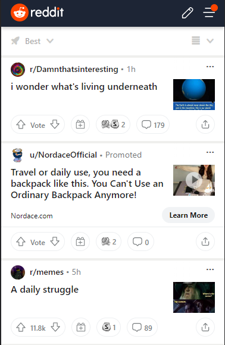
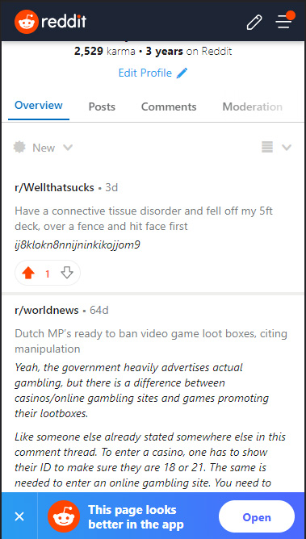

Link naar Website:
https://leonvdeursen.github.io/FEDwebsite/

# Procesverslag
Markdown is een simpele manier om HTML te schrijven.  
Markdown cheat cheet: [Hulp bij het schrijven van Markdown](https://github.com/adam-p/markdown-here/wiki/Markdown-Cheatsheet).

Nb. De standaardstructuur en de spartaanse opmaak van de README.md zijn helemaal prima. Het gaat om de inhoud van je procesverslag. Besteedt de tijd voor pracht en praal aan je website.

Nb. Door *open* toe te voegen aan een *details* element kun je deze standaard open zetten. Fijn om dat steeds voor de relevante stuk(ken) te doen.

## Jij

  
uitwerken voor kick-off werkgroep

  ### Auteur:
  Leon van Deursen

  #### Je startniveau:
  Rood

  #### Je focus:
 Responsive
 

## Je website

  
uitwerken voor kick-off werkgroep

  ### Je opdracht:
  Link: https://www.reddit.com
  Ik wil de website wat mooier maken sinds de website zelf nu best saai en leeg is. Vooral de desktop versie heeft enorm veel niet gebruikte zwarte stukken.

  #### Screenshot(s) van de eerste pagina (small screen): 
  Homepagina  
  

  #### Screenshot(s) van de tweede pagina (small screen):
  Profiel Pagina  
  
 

## Toegankelijkheidstest 1/2 (week 1)

  
uitwerken na test in 1e werkgroep

  ### Bevindingen
    #### Screenreader 
    - Headings lijken niet te werken op Reddit via screenreader.
    - Navigatie staat nog steeds bovenaan wanneer een screenreader actief is.
    - Reddit lijkt niet geoptimaliseerd te zijn voor een screenreader, Als je specifieke dingen wil lezen op reddit is daar geen mogelijkheid voor.

    #### Keyboard Navigation
    - Navigeren met de TAB knop en de pijltjes toetsen werken verbassingwekkend goed op Reddit
    - Misschien de mogelijkheid om gehele post te selecteren in plaats van 15 keer op TAB moeten drukken.

    #### Kleurenblindheid
    - Alles is nog goed leesbaar op Reddit, elfs in zwart-wit.
    - Het enige is dat het profiel icoontje erg slecht te zien is wanneer het zwart-wit is.

    #### Elastiek
    - Telefoon vasthouden is erg moeilijk
    - Typen is bijna niet te doen wanneer een hand niet te gebruiken is.
    - Scrollen door de posts gaat now wel.
    - erg moeilijk om opties hoog op het scherm aan te klikken.
    - Niet heel erg wanneer een laptop gebruikt wordt, met 1 hand typen op een laptop is nog best goed te doen.

    #### Ballon
    - Typen terwijl je de hele tijd afgeleid raakt is erg moeilijk
    - Lezen is nog te doen, alleen afbeedingen goed bekijken is weer lastig.
    - Scrollen en posts bekijken op reddit is best goed te doen.

    #### Spasmas Parkinson
    - Kleine opties aanklikken is erg moeilijk sinds je snel mis klikt door het trillen.
    - Typen is weer erg lastig, net zoals hierboven gezegd is is het erg moeilijk om de kleine toetsen aan te klikken.
    - Door reddit heen scrollen kan nog prima, alle headings zijn ook nog goed te lezen. 
    - Kleinere tekst is niet goed te lezen doordat het de hele tijd heen en weer trilt.

    #### Brillen
    - Liggend aan de bril verschilt het hoe vervelend het is.
    - De bril met de stip in het midden maakt het enorm lastig om goed een website te kunnen gebruiken. Niks is goed te lezen en het is moeilijk te onderscheiden waar       op de website je bent.
    - De bril die het wazig maakt is erg lastig met tekst lezen. De tekst moet erg groot zijn om het nog goed te kunnen lezen

  ### Mogelijke Oplossingen
  
    #### Screenreader
    - Verschil maken tussen links, headings, etc. zodat gebruikers met screenreaders makkelijker verschillende dingen kunnen selecteren.
    - Een mogelijkheid creëeren voor mensen met screenreaders om gehele posts te selecteren in plaats van dat ze 15 keer moeten swipen voordat ze bij de volgende post       zijn
    - De navigatie verplaatsen zodat gebruikers niet de gehele navigatie balk eert te horen krijgen wanneer ze de website op komen.

    #### Muis en Toetsenbord 
    - Een mogelijkheid creëeren om gehele posts te selecteren met de TAB knop in plaats van dat er 15 keer op gedrukt moet worden voordat ze bij de volgende post             zijn

    #### Motoriek (shocks, elastiekjes)
    - Kleine knoppen groter maken zodat het makkelijker is om in te drukken. Dit houd ook in de knoppen voor het toetsenboord.
    - Kleinere tekst groter maken zodat het makkelijker is voor de gebruiker om te lezen.

    #### Visueel (brillen, contrast, kleurenblind, dark/light). 
    - Kleinere tekst groter maken en het contrast tussen de achtergrond en de tekst zo goed mogelijk maken zodat het makkelijker is voor de gebruiker om te lezen.
    - Letten op de kleuren die ik ga gebruiken zodat het voor kleurenblinden ook goed leesbaar blijft.

## Breakdownschets (week 1)

  
uitwerken na afloop 2e werkgroep

  ### de hele pagina: 
  

  ### dynamisch deel (bijv menu): 
  

  ### wellicht nog een dynamisch deel (bijv filter): 
  

## Voortgang 1 (week 2)

  
uitwerken voor 1e voortgang

  ### Stand van zaken
  hier dit ging goed & dit was lastig (neem ook screenshots op van delen van je website en code)

  ### Agenda voor meeting
  samen met je groepje opstellen

  | student 1      | student 2          | student 3    | student 4        |
  | ---            | ---                | ---          | ---              |
  | dit bespreken  | en dit             | en ik dit    | en dan ik dat    |
  | en dat oo      | dit als er tijd is | nog een punt | dit wil ik zeker |
  | ...            | ...                | ...          | ...              |

Student 1: Meer informatie over Multi-Responsive-Design en hoe je dat moet toepassen.
Student 2: informatie vragen over de SVG foutmeldingen.
Student 3: wat er wordt verwacht als je het niet Multi-Responsive maakt. Hoe diep moet je op de rest gaan.
Student 4: Een dubbel check over hoe de html geschreven is.

  ### Verslag van meeting
  hier na afloop snel de uitkomsten van de meeting vastleggen

  - punt 1
  - punt 2
  - nog een punt
  - ...

## Voortgang 2 (week 3)

  
uitwerken voor 2e voortgang

  ### Stand van zaken
  hier dit ging goed & dit was lastig (neem ook screenshots op van delen van je website en code)

  ### Agenda voor meeting
  samen met je groepje opstellen

  | student 1      | student 2          | student 3    | student 4        |
  | ---            | ---                | ---          | ---              |
  | dit bespreken  | en dit             | en ik dit    | en dan ik dat    |
  | en dat ook nog | dit als er tijd is | nog een punt | dit wil ik zeker |
  | ...            | ...                | ...          | ...              |

  ### Verslag van meeting
  hier na afloop snel de uitkomsten van de meeting vastleggen

  - punt 1
  - punt 2
  - nog een punt
- ...

## Toegankelijkheidstest 2/2 (week 4)

  
uitwerken na test in 8e werkgroep

  ### Bevindingen
  Lijst met je bevindingen die in de test naar voren kwamen (geef ook aan wat er verbeterd is):

  #### Screenreader
  Hier korte omschrijving (met indien nodig afbeeldingen)

  Hier een omschrijving van hoe het opgelost kan worden (met indien nodig afbeeldingen)

  #### Muis en Toetsenbord 
  Hier korte omschrijving (met indien nodig afbeeldingen)

  Hier een omschrijving van hoe het opgelost kan worden (met indien nodig afbeeldingen)

  #### Motoriek (shocks, elastiekjes)
  Hier korte omschrijving (met indien nodig afbeeldingen)

  Hier een omschrijving van hoe het opgelost kan worden (met indien nodig afbeeldingen)

  #### Visueel (brillen, contrast, kleurenblind, dark/light). 
  Hier korte omschrijving (met indien nodig afbeeldingen)

  Hier een omschrijving van hoe het opgelost kan worden (met indien nodig afbeeldingen)

## Voortgang 3 (week 4)

  
uitwerken voor 3e voortgang

  ### Stand van zaken
  hier dit ging goed & dit was lastig (neem ook screenshots op van delen van je website en code)

  ### Agenda voor meeting
  samen met je groepje opstellen

  | student 1      | student 2          | student 3    | student 4        |
  | ---            | ---                | ---          | ---              |
  | dit bespreken  | en dit             | en ik dit    | en dan ik dat    |
  | en dat ook nog | dit als er tijd is | nog een punt | dit wil ik zeker |
  | ...            | ...                | ...          | ...              |

  ### Verslag van meeting
  hier na afloop snel de uitkomsten van de meeting vastleggen

  - punt 1
  - punt 2
  - nog een punt
  - ...

## Eindgesprek (week 5)

  
uitwerken voor eindgesprek

  ### Je uitkomst - karakteristiek screenshots:
  

  ### Dit ging goed/Heb ik geleerd: 
  Korte omschrijving met plaatjes

  

  ### Dit was lastig/Is niet gelukt:
  Korte omschrijving met plaatjes

  

## Bronnenlijst

  
continu bijhouden terwijl je werkt

  Nb. Wees specifiek ('css-tricks' als bron is bijv. niet specifiek genoeg).

  1. bron 1
  2. bron 2
  3. ...

